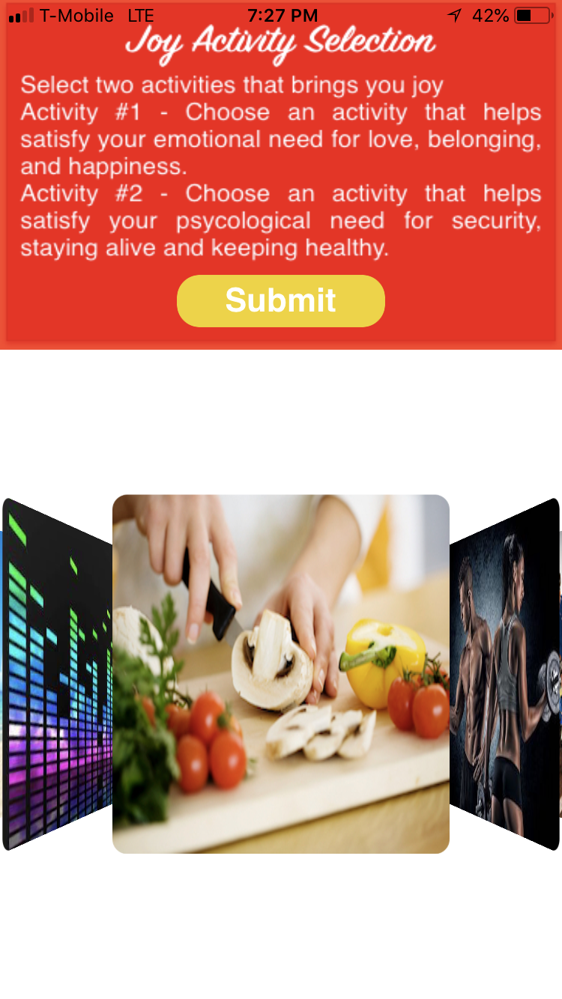
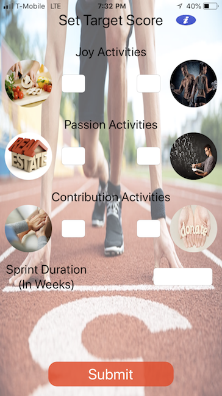

# FIU-SeniorProject
Senior Project Life Management 2.0

This is the version 2.0 of the Life Management project. Version 1.0 was based on a web application developed with MySQL and .Net framework.
Version 2.0 consists of the transition from web app to iOS and Andriod devices using their respective Native environment. I was tasked with developing a prototype for the iOS side and my two other teammates on the Android side.

In order to allow cross compatibility for the two operating systems the data was saved on Firebase database and images on Firebase storage.

The purpose of Life Management is to guide users to a more active and healthy lifestyle. Our approach will try to get users to become more active through engaging them in activities that bring out the emotions of joy, passion, and contribution.

Youtube video link to a guest user case 
https://www.youtube.com/watch?v=8481F749Ug&index=5&list=PLG3lylzOg8Fh9erMQ5yX-NxLJ--Ky59z3 

Youtube video link to a registered user case
https://www.youtube.com/watch?v=8481F749U-g&index=5&list=PLG3lylzOg8Fh9erMQ5yX-NxLJ--Ky59z3

Users can select two activities for each of the three different emotions

After selecting the activities, the user setups a target score indicating how many times he/she will engage in the activity for a certain period of time or cycle. The user also selects how long the cycle will last which can be from 1 to 3 weeks.

